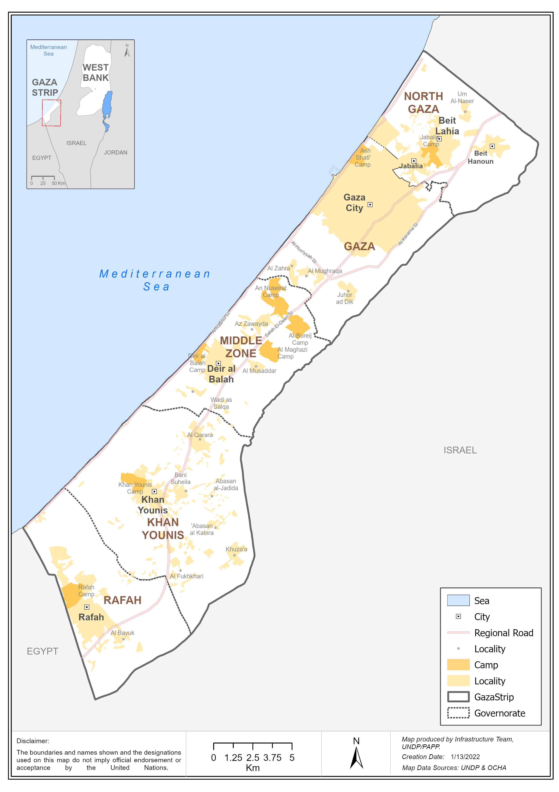
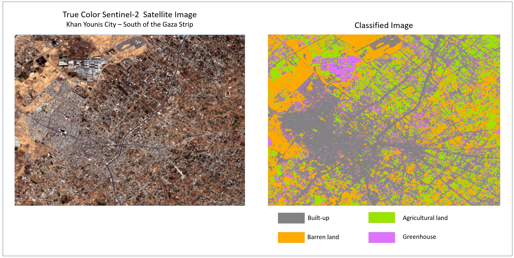
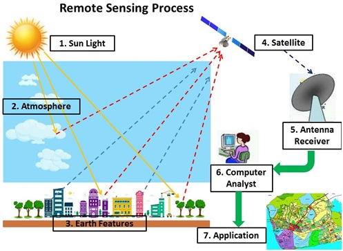
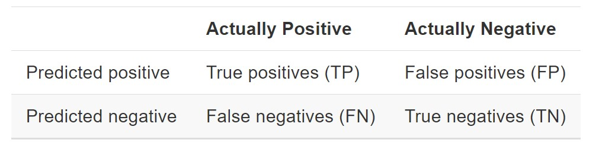
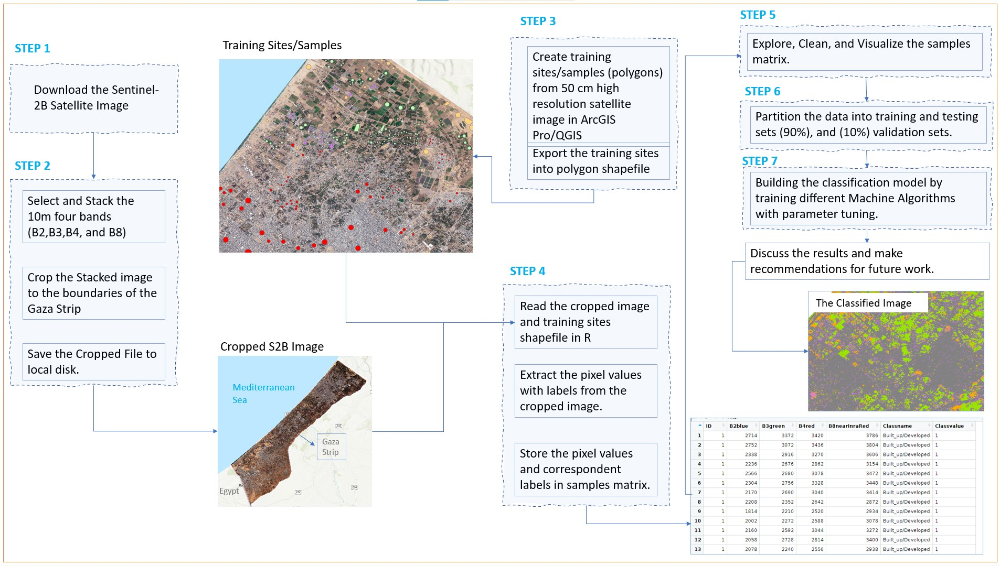
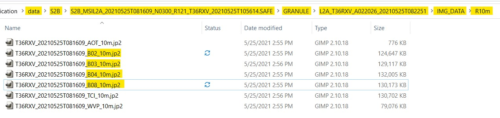
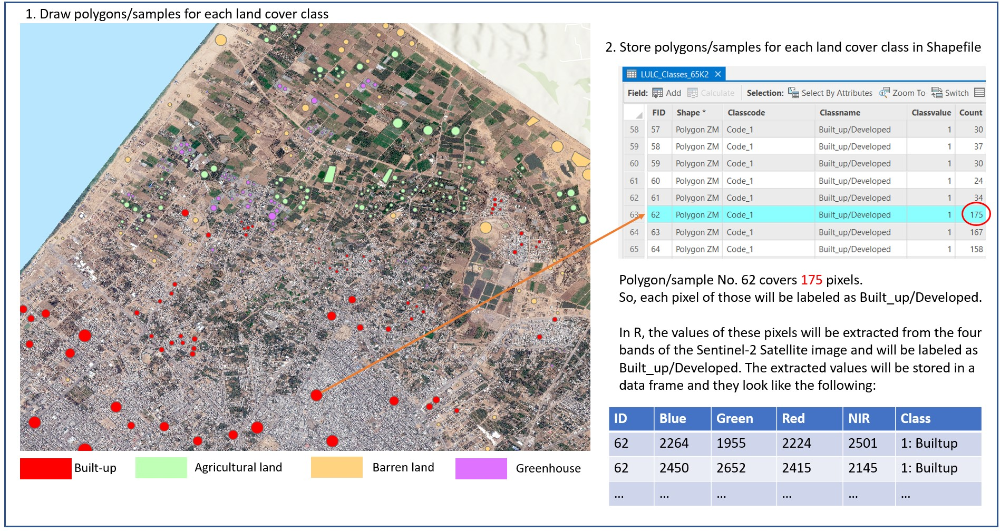

```{r setup, include=FALSE}
knitr::opts_chunk$set(echo = TRUE)
```

```{r install and import libraries, message=FALSE, warning=FALSE, include=FALSE}
if(!require(tidyverse)) install.packages("tidyverse", repos = "http://cran.us.r-project.org")
if(!require(caret)) install.packages("caret", repos = "http://cran.us.r-project.org")
if(!require(data.table)) install.packages("data.table", repos = "http://cran.us.r-project.org")
if(!require(raster)) install.packages("data.table", repos = "http://cran.us.r-project.org")
if(!require(GGally)) install.packages("GGally", repos = "http://cran.us.r-project.org")
if(!require(MASS)) install.packages("MASS", repos = "http://cran.us.r-project.org")
if(!require(naivebayes)) install.packages("naivebayes", repos = "http://cran.us.r-project.org")
if(!require(nnet)) install.packages("nnet", repos = "http://cran.us.r-project.org")
if(!require(rpart)) install.packages("rpart", repos = "http://cran.us.r-project.org")
if(!require(randomForest)) install.packages("randomForest", repos = "http://cran.us.r-project.org")
if(!require(kernlab)) install.packages("kernlab", repos = "http://cran.us.r-project.org")
if(!require(modeest)) install.packages("modeest", repos = "http://cran.us.r-project.org")

library(tidyverse)
library(caret)
library(data.table)
library(raster)
library(GGally)
library(MASS)
library(naivebayes)
library(nnet)
library(rpart)
library(randomForest)
library(kernlab)
library(modeest)
```

# Introduction
This report presents the methods and results of classifying a remotely sensed satellite image for the Gaza Strip in Palestine using different machine learning algorithms. The purpose of the classification is to generate updated land use and land cover (LULC) map using satellite image data. This map may be used within Geographical Information Systems (GIS) for further analysis to study the challenges facing the sustainable development in the Gaza Strip. Examples of such challenges are urban sprawl, agricultural land loss, and so on.  

This report is part of the capstone project of HarvardX’s Data Science Professional Certificate1 program. The project aims to select the most accurate model among several machine learning algorithms to classify a satellite image into 4 LULC classes: Builtup/developed areas, Green/Agricultural lands, barren lands, and greenhouses.  

The report is structured into 4 chapters: (1) Chapter 1 introduces the study area, LULC maps, satellite image classification, the satellite image dataset, the accuracy metrics for evaluation, (2) Chapter 2 discusses the methods used to classify the image with different machine learning algorithms. In addition, it explores the dataset through descriptive statistics and data visualization so that we could get more insights from the data, (3) Chapter 3 presents and discusses the results of different models and their performance, and finally (4) Chapter 4
concludes the project and gives recommendations for future work.  

## Study Area
The Gaza Strip is the study area for which LULC map will be produced. The Gaza Strip is located at eastern coast of the Mediterranean Sea of Palestine with a total area of $360 km^2$.  

The Gaza Strip is one of the most densely populated areas over the world. at the end of 2021, the number of population in the Gaza Strip reached 2.1 million persons, living on a very narrow area of $360 km^2$ [@PCBS2021]. As a result, significant portion of the Gaza Strip covered by built-up areas, and the other areas are either agricultural or barren lands. Gaza Strip lacks the surface water bodies and it depends on the groundwater as the main water resource.  
  
  


## Land Use/ Land Cover (LULC) Maps

Land Cover (LC) explains how much of a geographical area is covered by natural and man made features such as forests, wetlands, impervious surfaces, agriculture, and other land and water types. Land Use (LU) shows how people use the land whether for development, conservation, or mixed uses^[https://oceanservice.noaa.gov/facts/lclu.html]. In other words, LU Maps contain spatial information on the arrangements, activities and inputs people undertake in a certain land cover type to produce, change or maintain it^[https://land.copernicus.eu/global/products/lc].  

LULC maps can help decision makers assess urban growth, model water quality issues, predict and assess impacts from floods and storm surges, track wetland losses and potential impacts from sea level rise, prioritize areas for conservation efforts, and compare land cover changes with effects in the environment or to connections in socioeconomic changes such as increasing population.  

## Satellite Image Classification

There are many ways to produce up-to-date LULC maps, but the remotely sensed satellite images offer several advantages such as wide scope, using different parts of the electromagnetic spectrum to represent the features of phenomena, low cost, faster analysis (especially for large areas), and the option for repeated, short-term monitoring cycles[@rs13071349].  

Satellite Image Classification is the process of classifying the image pixels into different classes using machine learning algorithms in order to produce a map from the image. In case of LULC mapping, each pixel is assigned to one of land cover classes such as forest, water, built-up, vegetation, barren land, etc.  
The following figure may convey the meaning of image classification in the context of remotely sensed satellite images.  
  


With quick survey in the remote sensing literature, Several works have recently employed machine learning algorithms in satellite image classification. The most popular algorithms used are Discriminant Analysis (Maximum Likelihood Classification), K-Nearest Neighbor (KNN), Single Classification Tree, Random Forest(RF), Support Vector Machine(SVM), and Artificial Neural Network (ANN).   

Ghayour et al.[@rs13071349] evaluated the performance of Support Vector Machine (SVM), Artificial Neural Network (ANN), Maximum Likelihood Classification (MLC), Minimum Distance (MD), and Mahalanobis (MH) algorithms and compared them in order to generate a LULC map using data from Sentinel 2 and Landsat 8 satellites. The results showed that with optimal tuning parameters, the SVM classifier yielded the highest overall accuracy (OA) of 94%, performing better for both satellite data compared to other methods.  

Baamonde et al. [@BAAMONDE2019650] proposed a multi-temporal classification system to identify and represent diverse land cover classes over any period of the entire year by using Sentinel-2 satellite image data. They achieved a satisfactory mean accuracy value of 84.0% for the testing set using the best configuration with a radial Support Vector Machine classifier.  

Eoin Walsh et al. [@asr-18-65-2021] used a Convolutional Neural Network machine learning algorithm to segment satellite images into various land-cover classes. Sentinel-2 satellite imagery, the CORINE land-cover database and the BigEarthNet dataset are used.  

*In this project, we intended to use different machine algorithms to build an ensemble model that achieve highest accuracy possible. However, we found that Random Forest algorithm outperforms the ensemble model with overall accuracy of 90.8%.*  

## Remote Sensing and Satellites  

Remote Sensing refers to Earth Observation and information collection on earth surface remotely without touching the earth surface. This technology utilizes the satellites and drones to image the earth surface by passively or actively recording the electromagnetic spectrum coming or reflected from earth surface. Through detailed analysis of the spectral bands of these images, a lot of information on the earth can be obtained and used in different applications. For more information on Remote Sensing Technology, please visit this [NASA webpage](https://earthdata.nasa.gov/learn/backgrounders/remote-sensing).  

The following figure explains the process of remote sensing:  




Remote Sensing has been developing since 1800. Hundreds of satellites have been launched to collect information on earth surface. Each satellite has its own features and capabilities depending on the sensors it has.  

The most popular remote sensing satellites and missions are Landsat, SPOT, IKONOS, Sentinel, and many others.  


## Sentinel-2 Satellite
SENTINEL-2 is a European wide-swath, high-resolution, multi-spectral imaging mission. The full mission specification of the twin satellites flying in the same orbit but phased at 180°, is designed to give a high revisit frequency of 5 days at the Equator.  

SENTINEL-2 carries an optical instrument payload that samples 13 spectral bands: four bands at 10 m, six bands at 20 m and three bands at 60 m spatial resolution. The orbital swath width is 290 km. More details on these bands will come in the following sections.  

*In this project, we utilized the four bands with resolution 10 m to generate the LULC map of the Gaza Strip*  

You can find more information on Sentinel mission and satellites from Copernicus Program website, [here](https://sentinels.copernicus.eu/web/sentinel/home).  

## Evaluation Metrics

Evaluation metrics are very important tools to measure the performance of different models. In this report, we will use Confusion Matrix and Overall Accuracy as evaluation metrics.

### Confusion Matrix
It is a matrix that tabulates each combination of prediction and actual value. For two-classes classification, it has the following form[@rafaell2019]:  
  

  
The rows represent the predicted values and the columns represent the actual values.
TP (True Positives): is the number of actual positives that is correctly predicted as positive.
FP (False Positives): is the number of actual negatives that is falsely predicted as positives
FN (False Negatives): is the number of actual positives that is falsely predicted as negatives
TN (True Negatives): is the number of actual negatives that is correctly predicted as negatives.

### Overall Accuracy
The overall accuracy is simply defined as the overall proportion that is predicted correctly. It is calculated from the confusion matrix as follows[@rafaell2019]:  
$$
OA = \frac{TP}{TP+FP+FN+TN}
$$

## Sentinel-2 satellite image dataset

In this project, we downloaded the sentinel-2B satellite image from the copernicus website: https://scihub.copernicus.eu/dhus/#/home. The sensing date of the image is 25th May, 2021. The image has 13 spectral bands as follows:

- Four bands at resolution of 10 m: 490 nm (B2), 560 nm (B3), 665 nm (B4), 842 nm (B8)
- Six bands at resolution of 20 m: 705 nm (B5), 740 nm (B6), 783 nm (B7), 865 nm (B8a), 1 610 nm
(B11), 2 190 nm (B12)
- Three bands at resolution of 60 m: 443 nm (B1), 945 nm (B9) and 1 375 nm (B10).

In this project, we utilized those bands with resolution of 10m, namely, B2,B3,B4 and B8.
*B2 represents the blue band* of the visible portion of the spectrum, 
*B3 represents the green band* of the visible portion of the spectrum,
*B4 represents the red band* of the visible portion of the spectrum, and
*B8 represents the near infrared band* of the spectrum.

# Methods and analysis

The following figure outlines the whole process of classifying the satellite image, starting from the image download step until selecting the final model and obtaining the classified image.  

  
## Step 1: Download the Sentinel-2 Satellite Image
The image was downloaded from the Copernicus Open Access Hub website: https://scihub.copernicus.eu/dhus/#/home. The image covers an area that is larger than the Gaza Strip. So, the next step will be image cropping to the boundaries of the Gaza Strip. You will find the downloaded image in `data/S2B` folder with `*.SAFE` file format.  

  
  
## Step 2: Stack and Crop the image 
In this step, The four bands (B2,B3,B4,and B8) have been stacked in R using `stack()` from `raster` package. Stack process produces one file of the four bands instead of four separate files. Then, the stacked image was written to a new file on the local disk for future use.  
*Note: The stacked image has the four bands with new numbering scheme: B1:blue, B2:Green, B3:red, B4:Near Infrared bands.*  

```{r Stack the image, message=FALSE, warning=FALSE, include=TRUE}

# List all files in the image folder
imgFolder <- list.files("./data/S2B/S2B_MS~1.SAF/GRANULE/L2A_T3~1/IMG_DATA/R10m")

#Selection of desired bands (band 2, band3, band 4, and band 8)
bands <- c(grep('B02_10m', imgFolder, value=TRUE), # Blue band
           grep('B03_10m', imgFolder, value=TRUE), # Green band
           grep('B04_10m', imgFolder, value=TRUE), # Red band
           grep('B08_10m', imgFolder, value=TRUE)) # Near Infra-red band

# Create the Raster (image) Stack
rasterStack <- stack(paste0("./data/S2B/S2B_MS~1.SAF/GRANULE/L2A_T3~1/IMG_DATA/R10m/",
                            bands))

# Write the Raster Stack to new file
writeRaster(rasterStack,paste0("./data/StackedRasterS2B",".tif"),
            format="GTiff", overwrite = TRUE)
```

After saving the stacked image, we need to read it in R in order to crop it to the boundaries of the Gaza Strip. The `raster` package provides the function `crop()` that takes two arguments: (1) the stacked image and (2) the crop boundaries in shapefile format. The shapefile format is a simple, nontopological format for storing the geometric location and attribute information of geographic features^[https://desktop.arcgis.com/en/arcmap/10.3/manage-data/shapefiles/what-is-a-shapefile.htm].  

After cropping the image, it was saved into a new file on the local disk for future use.  

```{r Plot the downloaded image, message=FALSE, warning=FALSE, include=TRUE, fig.cap="The downloaded Sentinel-2 Satellite Image"}
# Load the stacked image/raster file
#The raster package offers '
#layer() - one file, one band
#stack() - multiple files, multiple bands
#brick() - one file, multiple bands

imgBrick <- brick("./data/StackedRasterS2B.tif")

# plot and visualize the true color composite image of the RGB bands.
plotRGB(imgBrick,r=3,g=2,b=1,stretch="lin")
```

```{r Crop the image, message=FALSE, warning=FALSE, include=TRUE, fig.cap= "The cropped Satellite Image"}
# Read the Shapefile of the Gaza Strip (crop boundary)
gazaShp <- shapefile("data/gaza/gazaStrip.shp")

# Mask the image to the crop boundary. We don't need any pixels outside the boundary.
masked <- mask(x=imgBrick, mask=gazaShp)

# Crop the masked image
cropped <- crop(x=masked, y=gazaShp)

# Plot the cropped image
plotRGB(cropped,r=3,g=2,b=1,stretch="lin")

# Write the Cropped Raster Brick to new file
writeRaster(cropped,paste0("./data/CroppedRasterS2B",".tif"),
            format="GTiff", overwrite = TRUE)
```

## Step 3: Create Training Sites/Samples

The goal of any machine learning algorithm is to predict a specific outcome when we don't know that outcome, based on a group of features/predictors. An example is to predict species of iris plant based on the features of sepal and petal such as length and width.  

The machine learning algorithm should first learn the patterns and relationships hidden in the data. To do so, the data should contain the features and the corresponding outcome or label. In `iris` data, 150 samples of the plant were collected. For each sample, four features (sepal length, sepal width, petal length, petal width) are recorded beside the species (outcome/label). The data is organized in alike-matrix structure where the rows represent the samples/observations and the columns represents the features and labels.  
The algorithm will take such data and learn the relationships in the training stage,  so that it can generalize and predict the outcome for new unseen (not used in the training) data (prediction stage).  

In our project, The aim is to classify (predict which class) the satellite
image based on the values of the pixels in each band. So, the features would be the four bands: red, green, blue, and near infrared. The outcome would be the type of land cover class.  
  
We have four outcomes/labels:  

1) Built-up/developed area: represents any developed or built up areas.
2) Agricultural/green land: represents any agricultural land that appear green in the satellite image.
3) Barren Land: represents any bare land, even it is agricultural land but it is not cultivated at the sensing time of the image.
4) Greenhouses: represents the greenhouses.  
  
So, to collect the data necessary for training data, we need to sample pixel values from each band and record the corresponding class. The challenge here is how to know which class this pixel belongs to. Fieldwork is necessary to collect ground truth data, however this could be time consuming and need more efforts for such project. The alternative is to sample pixel values for each class from 50cm high resolution satellite image. The process was done in ArcGIS Pro software, where we drawn thousands of polygons(samples/sites) for each class and label them, then they have been saved in a shapefile format for further processing in R, as will be explained in the next step. So, any pixel covered by builtup polygon will be labeled as built-up and so on. The following figure shows this process into more details.  
  
  
  
## Step 4: Build the samples (pixel values) matrix
In this step,  We will import the shapefile of the training polygons/samples (from step 3) into R, and  use the cropped Sentinel-2 Satellite image (from step 2) to extract the pixel values of the four bands with their corresponding labels. Refer to the previous figure for more details.  


```{r build the training data matrix, message=FALSE, warning=FALSE, include=TRUE}

# Read the shapefile of the training samples/polygons using
# shapefile() function from raster package.
SamplesShp <- shapefile("data/LCLU_Classes_65K/LULC_Classes_65K2.shp",
                        stringsAsFactors=TRUE)

# This is to check that both image and shapefile have the same
#Coordinate Reference System (CRS) so that they geospatially
#align together and the training samples are located exactly in
#their positions on the image.
compareCRS(cropped,SamplesShp)

#Rename Image Bands
names(cropped) <- c("B2blue", "B3green", "B4red", "B8nearInraRed")

# Extract the pixel values from the cropped sentinel-2 image.
# The pixel values are extracted without their corresponding labels.
samples_data <- raster::extract(cropped, SamplesShp,df=TRUE)

# We need to join the extracted pixel values with their
# corresponding labels from the sahpefile.
# Add n column to  the attribute table of shapefile to act like
# ID column that will be used for joining.
SamplesShpAttributes <- SamplesShp@data %>% mutate(n=1:n())

# Join the data from the sahpefile to extracted pixel values.
samples_data <- samples_data %>% left_join(SamplesShpAttributes, by=c("ID"="n"))

# Select the necessary columns.
data <- samples_data %>% dplyr::select(c(ID, B2blue, B3green,
                                         B4red, B8nearInraRed, Classname, Classvalue))

# Save the data for future use.
save(data, file="data/data.rda")
```

  
## Step 5: Explore, Clean and visualize the samples matrix
Before using the samples matrix with machine learning algorithms, we need to explore the data to understand the distributions, patterns and relationships between different bands (features). This is necessary, as some machine algorithms are parametric and assume Gaussian Distribution such as Naive Bayes. Moreover, through exploration we can also check if the data needs cleaning or preprocessing.    

Here is the summary of the samples matrix. It is clear that there are few `NA` values that can be omitted since we have enough sample size (more than 63,000 samples/pixels).  

```{r Explore samples matrix, message=FALSE, warning=FALSE, include=TRUE, echo=TRUE}

# Load the saved data
load(file="data/data.rda")

# Explore the samples matrix
summary(data)

```

```{r Delete missing values, message=FALSE, warning=FALSE, include=TRUE}
# Remove NAs Values
data <- data %>% filter(!is.na(B2blue))
knitr::kable(head(data), caption = "First rows of the data (samples matrix).")
```

  
The sample size becomes `r nrow(data)` after omitting the missing values.  

### Plot the distribution of the classes

It is important to have an idea about the distribution of the four classes in the data. The following figure shows the bar chart of the four classes.  

```{r Distribution of the classes, message=FALSE, warning=FALSE, include=TRUE, fig.cap="Distribution of the classes", fig.width=6, fig.height=4}
data %>% ggplot(aes(x=Classname, fill=Classname)) + geom_bar() +
  geom_text(aes(label=..count..),stat="count")
```
  
### Plot the spectral profile curves

The spectral profile curves are great tools to explore how each class values change in each band. This may gives an overview on which bands that can be used to separate/classify the classes.  

```{r Plot the spectral curves, message=FALSE, warning=FALSE, include=TRUE, fig.cap="Spectral Profile Curves", fig.width=6, fig.height=4}
# Calculate the mean pixel values by class and band
class_profiles <- data %>% dplyr::select(-ID) %>%
  group_by(Classname, Classvalue) %>% summarize_all(list(mean=mean)) %>% ungroup()

# Put the class_profiles in long format
class_profiles2 <- class_profiles %>% gather(key="band",
                                             value="mean_pixel_value", B2blue_mean:B8nearInraRed_mean) %>%
  mutate(band=str_remove(band,"_mean"))


# Plot the spectral profile
class_profiles2 %>% ggplot(aes(x=band, y=mean_pixel_value,
                               group=Classname, color=Classname))+ geom_line() + geom_point()
  
```

by inspecting the figure of the spectral profile curves, It is easy to conclude that as the gap between the curves increases at specific band, the easier to separate the classes using that band. For example, the blue band can easily be used to separate the agricultural class and the greenhouse class.  

### Explore the correlation between the bands
We need to explore if the bands are correlated or not. The following correlation matrix shows that the three bands of red, green, and blue are highly correlated, while Near Infrared band has quite weak correlation with the other three bands.  

```{r Correlation Matrix, message=FALSE,warning=FALSE,include=TRUE}
bands_corr_matrix <- data %>% dplyr::select(B2blue:B8nearInraRed) %>% cor()
knitr::kable(bands_corr_matrix, caption = "Correlation Matrix")

```
  
### Visualize the scatterplot matrix of bands and classes
This scatter plot matrix gives a comprehensive view of the relationships between the bands and classes.

```{r Scatterplot Matrix, message=FALSE,warning=FALSE,include=TRUE, fig.cap="Scatterplot Matrix of Bands and Classes"}
ggpairs(data, columns = 2:5, ggplot2::aes(colour=Classname))
```
  
## Step 6: Partition the data into training, testing, and validation sets

In this step, we are going to partition the data into two subsets: (1) training subset `train_samples_63k ` (90%), and (2) validation/testing subset (`test_samples_63k`) (10%). The validation set will be used for selecting the final model among several models, while the training set will be used for training models and parameters tuning.  

Since the models are to be trained on the personal LapTop, We need to reduce the sample size of `data` from `r nrow(data)` samples to a smaller size, say 10,000, so that it doesn't take much time in training. Moreover, It would be a chance to create a balanced dataset. In this way, we avoid the problems of imbalanced data.  
So, training sample, `train_samples_10k`, and validation sample, `validation_samples_10k` were used in training the models and selecting the final model. Then, we trained the final model on the whole dataset so that we can observe the effect of sample size on the overall accuracy.  

```{r Partitioning Data, include=TRUE, message=FALSE, warning=FALSE}
# Partition the whole Data (63,801 Pixels) into training, test, and validation data

# Create the validation set of the whole data
set.seed(1, sample.kind="Rounding")
validation_index <- createDataPartition(y = data$Classvalue,
                                        times = 1, p = 0.1, list = FALSE)
train_samples_63k <- data[-validation_index,]
test_samples_63k <- data[validation_index,]

# Sample 10,000 Observations(Pixels) from the whole data for training purposes.
# To avoid imbalanced dataset, we need to sample 2500 pixel from each class.

# Sample 10,000 pixel values (samples). 
set.seed(3, sample.kind="Rounding")
builtup_sample <- slice_sample(data[data$Classvalue=="1",],n=2500,replace = TRUE)
agricultural_sample <- slice_sample(data[data$Classvalue=="2",],n=2500,replace = TRUE)
greenhouse_sample <- slice_sample(data[data$Classvalue=="3",],n=2500,replace = TRUE)
barren_sample <- slice_sample(data[data$Classvalue=="4",],n=2500,replace = TRUE)

data_10k <- bind_rows(builtup_sample,agricultural_sample,greenhouse_sample,barren_sample)

# Partition subset of Data (10,000 Pixels) into training, test, and validation data

# Create the validation set from the 10,000 samples
set.seed(4, sample.kind="Rounding")
validation_indx <- createDataPartition(y = data_10k$Classvalue,
                                       times = 1, p = 0.1, list = FALSE)
train_samples_10k <- data_10k[-validation_indx,]
test_samples_10k <- data_10k[validation_indx,]

```

  
## Step 7: Building the classification models  
There are several machine learning algorithms that can be used in satellite image classification. With quick survey of the literature, the most popular algorithms are: (1) Quadratic Discriminant Analysis, (2) Linear Discriminant Analysis, (3) Naive Bayes , (4) Logistic Regression, (5) K-Nearest Neighbors (KNN), (6) Classification Tree, (7) Random Forest, (8) Support Vector Machine with linear kernel, (9) Support Vector Machine with radial kernel, and (10) Ensemble Model.  

### Quadratic Discriminant Analysis (QDA)
Discriminant analysis, also referred to as maximum likelihood classification in the remote sensing literature, is a long standing classification technique that distinguishes among classes by estimating multidimensional distances among classes, using either a linear or a quadratic discriminant function for a given set of explanatory variables. Discriminant analysis, though, assumes the data follows a multivariate normal distribution for quadratic discriminant analysis along with equal covariance for linear discriminant analysis[@EuJRS20134637].  

In this project, we have neglected the QDA assumptions. We will check them in another improved version of this project.  


```{r QDA, message=FALSE, warning=FALSE, include=TRUE}

set.seed(10, sample.kind="Rounding")
# train the model. QDA doesn't need parameter tuning as stated in caret manual.
train_qda <- train(Classvalue ~ B2blue + B3green + B4red + B8nearInraRed,
                  method = "qda",
                  data = train_samples_10k)

# test the trained model on the test data.
pred_class_qda <- predict(train_qda, test_samples_10k)
acc_qda <- confusionMatrix(pred_class_qda,
                test_samples_10k$Classvalue)$overall["Accuracy"]

kappa_qda <- confusionMatrix(pred_class_qda,
                test_samples_10k$Classvalue)$overall["Kappa"]

# Create tibbles to store the results
accuracy_results <- tibble(model="QDA",
                           Overall_Accuracy = acc_qda,
                           Kappa_Index = kappa_qda)

predicted_classes <- tibble(QDA = pred_class_qda)

```

After running the QDA algorithm, the overall accuracy is found to be `r acc_qda` on the testing data and Kappa Index is `r kappa_qda`.  

### Linear Discriminant Analysis (LDA)
Linear Discriminant Analysis (LDA) is a special case of QDA where the variance-covariance matrix is shared (equal) among the classes.  

In this project, we have also neglected the LDA assumptions. We will check them in another improved version of this project.  


```{r LDA, message=FALSE, warning=FALSE, include=TRUE}

set.seed(11, sample.kind="Rounding")
# train the model. LDA doesn't need parameter tuning as stated in caret manual.
train_lda <- train(Classvalue ~ B2blue + B3green + B4red + B8nearInraRed,
                  method = "lda",
                  data = train_samples_10k)

# Test the trained model on the test data.
pred_class_lda <- predict(train_lda, test_samples_10k)
acc_lda <- confusionMatrix(pred_class_lda,
                test_samples_10k$Classvalue)$overall["Accuracy"]

kappa_lda <- confusionMatrix(pred_class_lda,
                test_samples_10k$Classvalue)$overall["Kappa"]

# Create tibbles to store the results
accuracy_results <- 
  bind_rows(accuracy_results,
            tibble(model="LDA",
                   Overall_Accuracy = acc_lda, Kappa_Index=kappa_lda))

predicted_classes <- bind_cols(predicted_classes,
                               tibble(LDA = pred_class_lda)) 

```

After running the LDA algorithm, the overall accuracy is found to be `r acc_lda` on the testing data and Kappa Index is `r kappa_lda`.  


### Naive Bayes (NB)

Naive Bayes Algorithm is a special case of QDA where the main assumption is the features are independent. That means Variance-Covariance matrix is diagonal with zeros on the covariance cells.  

It is previously shown that the correlation between bands are highly correlated. So, Naive Bayes may have poor performance. We will neglect that assumption for now and run the Naive Bayes Algorithm.  


```{r NB, message=FALSE, warning=FALSE, include=TRUE}

set.seed(12, sample.kind="Rounding")
# train the model.
train_nb <- train(Classvalue ~ B2blue + B3green + B4red + B8nearInraRed,
                  method = "naive_bayes",
                  data = train_samples_10k)

# test the trained model on the test data.
pred_class_nb <- predict(train_nb, test_samples_10k)
acc_nb <- confusionMatrix(pred_class_nb,
                test_samples_10k$Classvalue)$overall["Accuracy"]
kappa_nb <- confusionMatrix(pred_class_nb,
                test_samples_10k$Classvalue)$overall["Kappa"]

# Create tibbles to store the results
accuracy_results <- bind_rows(accuracy_results,
                              tibble(model="NB",
                                     Overall_Accuracy = acc_nb,
                                     Kappa_Index=kappa_nb))

predicted_classes <- bind_cols(predicted_classes,tibble(NB = pred_class_nb)) 

```
  
After running the Naive Bayes algorithm, the overall accuracy is found to be `r acc_nb` on the testing data and Kappa Index is `r kappa_nb`.
  
### Logistic Regression

We have fit a multinomial logistic regression since the outcome variable has four classes.  
  

```{r Logistic, message=FALSE, warning=FALSE, include=TRUE, results='hide'}

set.seed(13, sample.kind="Rounding")
# train the model.
train_log <- train(Classvalue ~ B2blue + B3green + B4red + B8nearInraRed,
                  method = "multinom",
                  data = train_samples_10k)

# test the trained model on the test data.
pred_class_log <- predict(train_log, test_samples_10k)
acc_log <- confusionMatrix(pred_class_log,
                test_samples_10k$Classvalue)$overall["Accuracy"]

kappa_log <- confusionMatrix(pred_class_log,
                test_samples_10k$Classvalue)$overall["Kappa"]

# Create tibbles to store the results
accuracy_results <- bind_rows(accuracy_results,
                              tibble(model="Logistic",
                                     Overall_Accuracy = acc_log,
                                     Kappa_Index=kappa_log))

predicted_classes <- bind_cols(predicted_classes,tibble(Logistic = pred_class_log)) 

```
  
After running the multinomial logistic regression algorithm, the overall accuracy is found to be `r acc_log` on the testing data and Kappa Index is `r kappa_log`. 
  
### K-Nearest Neighbors (KNN)

K-Nearest Neighbors classifies the new data point based on the nearest k neighbors. k is the tuning parameter that should be selected to get the highest accuracy possible from KNN algorithm.  
KNN is the first non-parametric algorithm that doesn't assume any specific distribution of the data.  


```{r message=FALSE, warning=FALSE, include=TRUE}

set.seed(14, sample.kind="Rounding")
# Set tuning parameter space to be searched
tune_grid <- data.frame(k = seq(1, 21, 2))

# train the model.
train_knn <- train(Classvalue ~ B2blue + B3green + B4red + B8nearInraRed,
                  method = "knn",
                  data = train_samples_10k,
                  tuneGrid = tune_grid)

# test the trained model on the test data.
pred_class_knn <- predict(train_knn, test_samples_10k)
acc_knn <- confusionMatrix(pred_class_knn,
                test_samples_10k$Classvalue)$overall["Accuracy"]

kappa_knn <- confusionMatrix(pred_class_knn,
                test_samples_10k$Classvalue)$overall["Kappa"]

# Create tibbles to store the results
accuracy_results <- bind_rows(accuracy_results,
                              tibble(model="KNN",
                                     Overall_Accuracy = acc_knn,
                                     Kappa_Index = kappa_knn))

predicted_classes <- bind_cols(predicted_classes,tibble(KNN = pred_class_knn)) 

```
  
After running KNN algorithm, the overall accuracy is found to be `r acc_knn` on the testing data and Kappa Index is `r kappa_knn`. The optimal K is found to be `r train_knn$bestTune[[1]]`.
  
### Classification Tree

A single decision classification tree is used for the satellite image classification. The complexity parameter (cp) is tuned to get the highest accuracy possible.
  

```{r Ctree, message=FALSE, warning=FALSE, include=TRUE}

set.seed(15, sample.kind="Rounding")

# Set complexity parameter (cP) space to be searched
tune_grid <- data.frame(cp = seq(0, 0.1, len=30))

# train the model.
train_Ctree <- train(Classvalue ~ B2blue + B3green + B4red + B8nearInraRed,
                  method = "rpart",
                  data = train_samples_10k,
                  tuneGrid = tune_grid)

# test the trained model on the test data.
pred_class_Ctree <- predict(train_Ctree, test_samples_10k)
acc_Ctree <- confusionMatrix(pred_class_Ctree,
                test_samples_10k$Classvalue)$overall["Accuracy"]
kappa_Ctree <- confusionMatrix(pred_class_Ctree,
                test_samples_10k$Classvalue)$overall["Kappa"]

# Create tibbles to store the results
accuracy_results <- bind_rows(accuracy_results,
                              tibble(model="C.Tree",
                                     Overall_Accuracy = acc_Ctree,
                                     Kappa_Index=kappa_Ctree))

predicted_classes <- bind_cols(predicted_classes,tibble(C.Tree = pred_class_Ctree)) 

```
  
After running the single classification tree algorithm, the overall accuracy is found to be `r acc_Ctree` on the testing data and Kappa Index is `r kappa_Ctree`.
  
### Random Forest

Random Forest uses several weak single decision trees to train the data. The results from all tress are averaged in case of regression or majority vote is calculated for classification.  
  
Random Forest uses part of the features or observations for each tree. So, one of the most important parameters to be tuned is the number of features used, `mtry`.
  

```{r RF, message=FALSE, warning=FALSE, include=TRUE}

set.seed(16, sample.kind="Rounding")

# Set mtry parameter space to be searched
tune_grid <- data.frame(mtry = c(1, 2, 3, 4))

# train the model.
train_rf <- train(Classvalue ~ B2blue + B3green + B4red + B8nearInraRed,
                  method = "rf",
                  data = train_samples_10k,
                  tuneGrid = tune_grid)

# test the trained model on the test data.
pred_class_rf <- predict(train_rf, test_samples_10k)
acc_rf <- confusionMatrix(pred_class_rf,
                test_samples_10k$Classvalue)$overall["Accuracy"]
kappa_rf <- confusionMatrix(pred_class_rf,
                test_samples_10k$Classvalue)$overall["Kappa"]


# Create tibbles to store the results
accuracy_results <- bind_rows(accuracy_results,
                              tibble(model="RF",
                                     Overall_Accuracy = acc_rf,
                                     Kappa_Index=kappa_rf))

predicted_classes <- bind_cols(predicted_classes,tibble(RF = pred_class_rf)) 

```
  
After running the Random Forest algorithm, the overall accuracy is found to be `r acc_rf` on the testing data and Kappa Index is `r kappa_rf`. The optimal number of features `mtry` is `r train_rf$bestTune[[1]]`.
  
### Support Vector Machine with Linear Kernel (SVM Linear)

Support Vector Machine (SVM) is one of the popular algorithms used in classifying the remotely sensed images. It usually outperforms other traditional methods and compete with Random Forest. 
  
SVM is originally a linear classifier that separates the classes through hyperplanes. However, it  can also be used in non-linear classification problems using what is called _Kernel Trick_, Which is a way to transform features to higher dimension space where it is possible to linearly separate the classes.  
  

```{r SVML, message=FALSE, warning=FALSE, include=TRUE}

set.seed(17, sample.kind="Rounding")

# Set C (cost) parameter space to be searched
tune_grid <- data.frame(C = seq(0, 30, 1))

# train the model.
train_svml <- train(Classvalue ~ B2blue + B3green + B4red + B8nearInraRed,
                  method = "svmLinear",
                  data = train_samples_10k,
                  tuneGrid = tune_grid
                  )

# test the trained model on the test data.
pred_class_svml <- predict(train_svml, test_samples_10k)
acc_svml <- confusionMatrix(pred_class_svml,
                test_samples_10k$Classvalue)$overall["Accuracy"]

kappa_svml <- confusionMatrix(pred_class_svml,
                test_samples_10k$Classvalue)$overall["Kappa"]


# Create tibbles to store the results
accuracy_results <- bind_rows(accuracy_results,
                              tibble(model="SVM_Linear",
                                     Overall_Accuracy = acc_svml,
                                     Kappa_Index = kappa_svml))

predicted_classes <- bind_cols(predicted_classes,tibble(SVM_Linear = pred_class_svml)) 

```
  
In this section, We used linear kernel. After running the SVM Linear algorithm, the overall accuracy is found to be `r acc_svml` on the testing data and Kappa Index is `r `kappa_svml`. The optimal Cost parameter C is found to be `r train_svml$bestTune[[1]]`.
  
### Support Vector Machine with Radial Basis Kernel

In this section, We used radial basis kernel.  

```{r SVMR, message=FALSE, warning=FALSE, include=TRUE}

set.seed(18, sample.kind="Rounding")

# Set C (cost) parameter space to be searched
tune_grid <- data.frame(C = seq(0, 30, 3))

# train the model.
train_svmr <- train(Classvalue ~ B2blue + B3green + B4red + B8nearInraRed,
                  method = "svmRadialCost",
                  data = train_samples_10k,
                  tuneGrid = tune_grid,
                  )

# test the trained model on the test data.
pred_class_svmr <- predict(train_svmr, test_samples_10k)
acc_svmr <- confusionMatrix(pred_class_svmr,
                test_samples_10k$Classvalue)$overall["Accuracy"]

kappa_svmr <- confusionMatrix(pred_class_svmr,
                test_samples_10k$Classvalue)$overall["Kappa"]


# Create tibbles to store the results
accuracy_results <- bind_rows(accuracy_results,
                              tibble(model="SVM_Radial",
                                     Overall_Accuracy = acc_svmr,
                                     Kappa_Index = kappa_svmr))

predicted_classes <- bind_cols(predicted_classes,tibble(SVM_Radial = pred_class_svmr))
```
  
After running the SVM Radial algorithm, the overall accuracy is found to be `r acc_svmr` on the testing data and Kappa Index is `r `kappa_svmr`. The optimal Cost parameter C is found to be `r train_svmr$bestTune[[1]]`.
  
### The Ensemble Model

In this section, we try to build an ensemble model that can performs very well and better than the individual models. The ensemble model is built by taking the majority vote of the predicted classes from all models. However, in this project, we excluded those models with low accuracy. A threshold accuracy of `0.87` was set so that any model with lower accuracy will be excluded.
  

```{r Ensemble, message=FALSE, warning=FALSE, include=TRUE}

# Select Models with accuracy larger than 0.87 (87%)
accuracy_results_88per <- accuracy_results %>% filter(Overall_Accuracy >= 0.87)
predicted_classes_88per <- predicted_classes %>%
  dplyr::select(pull(accuracy_results_88per["model"]))

# Create the ensemble model prediction through majority vote by
# Selecting the most frequent predicted value among the models.
pred_class_ensemble <- apply(predicted_classes_88per,1, mfv1)

# Calculate the Accuracy
acc_ensemble <- confusionMatrix(as.factor(pred_class_ensemble),
                test_samples_10k$Classvalue)$overall["Accuracy"]
kappa_ensemble <- confusionMatrix(as.factor(pred_class_ensemble),
                test_samples_10k$Classvalue)$overall["Kappa"]

# Create tibbles to store the results
accuracy_results <- bind_rows(accuracy_results,
                              tibble(model="Ensemble",
                                     Overall_Accuracy = acc_ensemble,
                                     Kappa_Index = kappa_ensemble))

predicted_classes <- bind_cols(predicted_classes,tibble(Ensemble = pred_class_ensemble))
```
  
The ensemble model recorded overall accuracy of `r acc_ensemble` on the testing data and Kappa Index is found to be `r kappa_ensemble`. 
  
# Results

The following table shows the different models with their overall accuracies on the testing dataset and their Kappa Indices.  

```{r Results Plot, message=FALSE, warning=FALSE, include=TRUE, fig.cap="Performance of all models"}
knitr::kable(accuracy_results, caption = "Table of performance of all models")

accuracy_results %>% ggplot(aes(x=model, y=Overall_Accuracy, group=1)) +
  geom_line() + geom_point()
```

  
From the table, one could easily observe that the parametric methods (QDA, LDA, Naive Bayes and Logistic Regression) perform quite poorly if compared with the non-parametric methods. This can be attributed to invalidity of some assumptions about the data. For example, we found that the bands of the image are highly correlated, which violates the main assumption of Naive Bayes that assumes full independence among the features. This may interpret why the Naive Bayes records the lowest accuracy among all models.  
  
The Random forest outperforms all models including the simple model with overall accuracy of `r acc_rf` and Kappa Index of `r kappa_rf`. Support Vector Machine competes with Random Forest. SVM with radial basis kernel outperforms that of linear kernel.
  
It worth mentioning that training sample size plays an important role in obtaining high accuracy. It is expected that as training size increases, the accuracy will also increase. We can prove this by running the final model of Random Forest on the whole samples data of `r nrow(data)` pixels.  
  

```{r RF_63K, message=FALSE, warning=FALSE, include=TRUE}

set.seed(160, sample.kind="Rounding")

# train the model.
train_rf_63k <- train(Classvalue ~ B2blue + B3green + B4red + B8nearInraRed,
                  method = "rf",
                  data = train_samples_63k)

# test the trained model on the test data.
pred_class_rf_63k <- predict(train_rf_63k, test_samples_63k)
conf_mat_rf_63k <- confusionMatrix(pred_class_rf_63k,
                test_samples_63k$Classvalue)

print(conf_mat_rf_63k)

```
  
After running the random forest model on the whole training dataset, the overall accuracy is increased to be `r conf_mat_rf_63k$overall["Accuracy"]` on the whole testing data and Kappa Index is increased to be `r conf_mat_rf_63k$overall["Kappa"]`. 
  
## Classify the Whole Image

It is now time to use the final model in classifying the whole study area of the Gaza Strip and produce a classified image to be used in GIS and other applications.
  
```{r Classify the whole image, message=FALSE, warning=FALSE, include=TRUE}
classified <- predict(cropped,train_rf_63k, type = "raw")
plot(classified)
writeRaster(classified,paste0("./outputs/classifiedImage_RF",".tif"),
            format="GTiff", overwrite = TRUE)
```
  
# Recommendations and Conclusion

It can be concluded that Random Forest and Support Vector Machines are great algorithms that can achieve high accuracy with remotely sensed satellite images. It is recommended invest in these methods to explore more about their behavior with Sentinel-2 Satellite Images and explore more about parameter tuning to increase the accuracy.
  
Moreover, Sample Size is an important factor in increasing the accuracy; it is recommended that more investigation of the sample size should be done to study the effect of sample size on the accuracy. The goal should be: what is the optimal sample size that can achieve high accuracy, and save time and effort in collecting samples.
